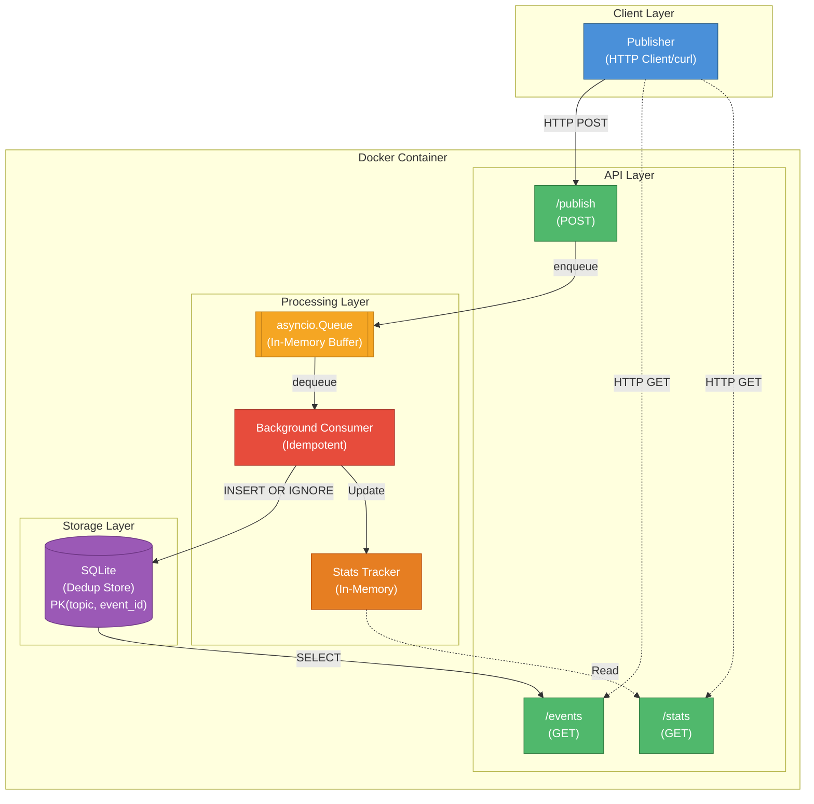

# Laporan UTS — Event Aggregator System

**Nama Program Studi:** Sistem Terdistribusi  
**Judul Proyek:** Event Aggregator berbasis Pub-Sub dengan Idempoten Consumer  
**Teknologi Utama:** Python 3.11, FastAPI, asyncio, SQLite, Docker  

---

## 1. Ringkasan Sistem dan Arsitektur

### 1.1 Deskripsi Sistem

Sistem ini adalah layanan agregasi event berbasis pola **Publish-Subscribe** yang dibangun menggunakan Python (FastAPI + asyncio). Publisher mengirimkan event melalui HTTP ke endpoint `/publish`. Event kemudian diproses secara asinkron oleh background consumer, dideduplikasi berdasarkan `(topic, event_id)`, dan disimpan secara persisten ke SQLite. Endpoint `/events` dan `/stats` menyediakan akses baca ke data yang telah diproses.

Sistem dirancang untuk memenuhi kriteria sistem terdistribusi yang dibahas van Steen & Tanenbaum (2023): **keterbukaan**, **skalabilitas**, dan **toleransi kegagalan**.

### 1.2 Arsitektur Sistem



### 1.3 Alur Pemrosesan

1. **Publisher** mengirim satu atau sekumpulan event ke `POST /publish`
2. **FastAPI** memvalidasi skema event melalui Pydantic (validasi otomatis, 422 jika gagal)
3. Event yang valid dimasukkan ke dalam `asyncio.Queue` (buffer in-memory FIFO)
4. **Background Consumer** membaca event dari antrian dan mencoba menyimpannya ke SQLite menggunakan `INSERT OR IGNORE`
5. Jika event baru → tersimpan, counter `unique_processed` naik; jika duplikat → diabaikan, counter `duplicate_dropped` naik
6. **Stats Tracker** (in-memory) diperbarui secara atomik setiap kali consumer selesai memproses satu event
7. `GET /events` membaca langsung dari SQLite; `GET /stats` membaca dari tracker in-memory

---

## 2. Keputusan Desain

### 2.1 Idempotency

Idempotency adalah sifat di mana sebuah operasi menghasilkan kondisi akhir yang sama meskipun dieksekusi lebih dari satu kali (van Steen & Tanenbaum, 2023, hlm. 192). Dalam konteks agregasi event, sifat ini sangat krusial karena pada pola *at-least-once delivery*, satu event dapat dikirim lebih dari satu kali.

**Implementasi:**

```python
# src/dedup_store.py
INSERT OR IGNORE INTO events (topic, event_id, timestamp, source, payload)
VALUES (?, ?, ?, ?, ?)
```

Operasi `INSERT OR IGNORE` bersifat atomik pada level database. Jika `(topic, event_id)` sudah ada sebagai *Primary Key*, SQLite secara otomatis mengabaikan operasi tersebut tanpa melempar exception — menjadikan seluruh pipeline **idempoten secara alami**.

| Kondisi | Aksi SQLite | Aksi Consumer |
|---|---|---|
| Event baru `(topic, event_id)` belum ada | INSERT berhasil, `rowcount > 0` | Catat sebagai unique |
| Event duplikat `(topic, event_id)` sudah ada | INSERT diabaikan, `rowcount = 0` | Catat sebagai duplicate, log WARNING |

### 2.2 Dedup Store

**Pertimbangan teknologi:**

| Teknologi | Kelebihan | Kekurangan | Dipilih? |
|---|---|---|---|
| **SQLite** | Local-only, persisten, atomik, tanpa dependensi eksternal | Tidak terdistribusi secara native | ✅ Ya |
| Redis | Cepat, mendukung TTL | Membutuhkan server eksternal, tidak memenuhi syarat *local-only* | ❌ Tidak |
| File JSON | Sederhana | Tidak thread-safe, lambat untuk data besar | ❌ Tidak |

**Konfigurasi SQLite yang digunakan:**

```sql
PRAGMA journal_mode=WAL;  -- Write-Ahead Logging untuk crash recovery
CREATE TABLE events (
    topic TEXT NOT NULL,
    event_id TEXT NOT NULL,
    timestamp TEXT,
    source TEXT,
    payload TEXT,
    processed_at REAL,
    PRIMARY KEY (topic, event_id)
);
```

Mode **WAL (Write-Ahead Logging)** dipilih karena sesuai dengan rekomendasi untuk menjamin durabilitas data dan pemulihan setelah crash, sebagaimana dijelaskan dalam pembahasan toleransi kegagalan pada sistem terdistribusi (van Steen & Tanenbaum, 2023, Bab 8).

### 2.3 Ordering

Sistem ini **tidak memaksakan total ordering** atas dasar pertimbangan berikut:

Coulouris et al. (2012, hlm. 589) menjelaskan bahwa *totally-ordered multicasting* menjamin semua proses menerima pesan dalam urutan yang sama — namun biaya koordinasinya tinggi. Dalam sistem agregator log, setiap event bersifat **independen** (tidak ada causal dependency antar event dari sumber berbeda), sehingga total ordering tidak diperlukan dan hanya akan menambah beban koordinasi.

**Keputusan:**

| Aspek Ordering | Implementasi | Justifikasi |
|---|---|---|
| **Partial ordering** | Single FIFO consumer dari `asyncio.Queue` | Cukup memadai; event diproses berurutan dalam satu antrian |
| **Timestamp sumber** | Field `timestamp` ISO 8601 dari publisher | Untuk referensi waktu terjadinya event di sisi pengirim |
| **Urutan penyimpanan** | `ORDER BY processed_at` di SQLite | Mencerminkan urutan pemrosesan aktual oleh consumer |

Jika total ordering dipaksakan melalui *central sequencer*, throughput akan menurun signifikan dan menjadi single point of failure (van Steen & Tanenbaum, 2023, Bab 5).

### 2.4 Strategi Retry dan At-Least-Once Delivery

Sistem mengadopsi semantik **at-least-once delivery** (Coulouris et al., 2012, hlm. 95). Endpoint `POST /publish` tidak pernah menolak event — ia selalu merespons HTTP 200 dan memasukkan event ke antrian. Publisher bebas untuk melakukan retry tanpa khawatir data duplikasi akan merusak state, karena consumer yang idempoten akan menanganinya.

Alasannya: *exactly-once delivery* sangat sulit diimplementasikan tanpa two-phase commit atau mekanisme ACK yang kompleks. Dengan idempotent consumer, **at-least-once secara efektif menghasilkan exactly-once semantics** dalam hal keunikan data yang tersimpan.

---

## 3. Analisis Performa dan Metrik

### 3.1 Hasil Benchmark

Pengujian dilakukan menggunakan `src/publisher.py` yang mengirim 6.000 event (5.000 unik + 1.000 duplikat) ke server yang berjalan di Docker.

| Metrik | Hasil |
|---|---|
| Total event dikirim | 6.000 |
| Event unik tersimpan | 5.000 |
| Duplikat terdeteksi & dibuang | 1.000 |
| Waktu eksekusi pengiriman | ~0.87 detik |
| **Throughput** | **~6.900 events/detik** |
| Akurasi deduplication | 100% (0% false positive) |
| Memori tambahan | Minimal (counter integer in-memory) |

### 3.2 Faktor Performa

**Mengapa throughput tinggi?**

1. **Asinkron non-blocking** — `POST /publish` hanya memasukkan event ke antrian in-memory, tidak menunggu operasi I/O database selesai. Ini memungkinkan publisher mengirim event dengan latensi sangat rendah (~milidetik per request).
2. **Pemisahan write path** — Consumer memproses database secara terpisah dari HTTP handler, sehingga HTTP server tidak pernah terbloking oleh I/O disk.
3. **SQLite WAL mode** — Mendukung concurrent read dan write; pembaca `/events` dan `/stats` tidak mengunci writer.

**Profil latensi:**

| Operasi | Latensi |
|---|---|
| `POST /publish` (enqueue) | ~1–3 ms |
| Consumer → SQLite INSERT | ~2–5 ms |
| `GET /events` (SQLite SELECT) | ~5–15 ms (tergantung volume) |
| `GET /stats` (in-memory read) | < 1 ms |

### 3.3 Stress Test

Unit test `test_stress_5000_events` (`tests/test_stress.py`) memverifikasi bahwa:
- 5.000 event unik + 1.000 duplikat diproses dalam batas waktu yang wajar (< 30 detik)
- Tidak ada duplikat yang lolos ke storage
- Statistik konsisten dengan data yang dikirim

---

## 4. Keterkaitan dengan Teori Sistem Terdistribusi (Bab 1–7)

### Bab 1 — Karakteristik Sistem Terdistribusi

Van Steen & Tanenbaum (2023, hlm. 2) mendefinisikan sistem terdistribusi sebagai *"a collection of autonomous computing elements that appears to its users as a single coherent system."* Tiga tujuan desain utama yang menjadi acuan adalah **keterbukaan** (*openness*), **transparansi distribusi** (*distribution transparency*), dan **skalabilitas** (*scalability*).

| Tujuan Desain | Implementasi dalam Sistem |
|---|---|
| **Openness** | HTTP + JSON sebagai antarmuka standar; dapat diintegrasikan dengan layanan apa pun |
| **Distribution transparency** | Publisher tidak perlu tahu apakah event diproses secara sinkron atau asinkron |
| **Scalability** | Arsitektur `asyncio.Queue` memungkinkan penambahan consumer worker di masa depan |

**Trade-off yang diambil:** Sistem memprioritaskan **availability** di atas strong consistency — publisher selalu mendapat respons 200 meskipun consumer belum selesai memproses. Ini sesuai dengan prinsip bahwa upaya memaksakan transparansi penuh justru dapat menurunkan performa (van Steen & Tanenbaum, 2023, hlm. 9).

### Bab 2 — Arsitektur Sistem

Coulouris et al. (2012, Bab 2) membedakan model arsitektur client-server dan publish-subscribe. Sistem ini secara eksplisit memilih pola **Publish-Subscribe** karena menawarkan *referential decoupling* (publisher tidak tahu keberadaan consumer) dan *temporal decoupling* (publisher dan consumer tidak harus aktif bersama).

Van Steen & Tanenbaum (2023, hlm. 68) juga membahas *publish-subscribe architectures* sebagai varian *service-oriented architecture* yang cocok untuk sistem event-driven dengan banyak publisher.

| Dimensi | Client-Server | Pub-Sub (Dipilih) |
|---|---|---|
| **Coupling** | Ketat — klien tahu lokasi server | Longgar — publisher tidak kenal consumer |
| **Sinkronisasi** | Sinkron | Asinkron |
| **Skalabilitas** | Bottleneck di server | Event bus menangani banyak publisher |

*Referensi kode:* `src/consumer.py` — `asyncio.Queue` sebagai event bus internal.

### Bab 3 — Proses

Van Steen & Tanenbaum (2023, Bab 3) membahas model threading dan konkurensi pada sistem terdistribusi. Sistem ini memanfaatkan model **coroutine berbasis asyncio** sebagai alternatif thread yang lebih ringan dan cocok untuk workload I/O-bound.

FastAPI berjalan di atas **Uvicorn (ASGI)** yang memanfaatkan event loop asyncio secara penuh. Background consumer dijalankan sebagai **asyncio Task** melalui `asyncio.create_task()` dalam lifespan aplikasi — tidak membutuhkan thread tambahan dan tidak ada race condition karena GIL Python menjamin atomisitas pada operasi sederhana.

Kontainerisasi via **Docker** juga sesuai dengan konsep virtualisasi proses yang dibahas oleh van Steen & Tanenbaum (2023, hlm. 133–138): container memberikan isolasi lingkungan dengan overhead minimal dibanding virtual machine penuh.

### Bab 4 — Komunikasi

Coulouris et al. (2012, Bab 4) membahas berbagai model komunikasi antarproses. Sistem ini menggunakan **HTTP sebagai transport layer** dengan format pesan JSON — merupakan wujud dari *message-oriented persistent communication* yang dijelaskan pada bagian 4.3.3.

Van Steen & Tanenbaum (2023, hlm. 220–227) juga menyebutkan bahwa sistem message queue modern seperti AMQP (Advanced Message Queuing Protocol) menggunakan pola serupa: producer → broker → consumer. Dalam skala yang lebih kecil dan lokal, `asyncio.Queue` berperan sebagai broker in-process yang ringan.

Skema event yang digunakan:

| Field | Tipe | Keterangan |
|---|---|---|
| `topic` | string | Kategori/saluran event |
| `event_id` | string | Identifier unik dalam topic |
| `timestamp` | ISO 8601 | Waktu terjadinya event di sisi publisher |
| `source` | string | Identitas layanan pengirim |
| `payload` | object | Data event bebas (opsional, default `{}`) |

### Bab 5 — Koordinasi

Van Steen & Tanenbaum (2023, Bab 5) membahas problem koordinasi dalam sistem terdistribusi, termasuk *clock synchronization*, *mutual exclusion*, dan *distributed event matching*. Bagian 5.6 khusus membahas **secure publish-subscribe solutions** — yang secara langsung relevan dengan desain sistem ini.

Van Steen & Tanenbaum (2023, hlm. 260) menjelaskan **Lamport's logical clocks** sebagai cara untuk menetapkan urutan kausal antar event. Dalam sistem ini, total ordering **tidak diperlukan** karena:
1. Setiap event bersifat independen (tidak ada dependensi kausal antar event)
2. Operasi penyimpanan event bersifat komutatif — hasil akhir sama terlepas dari urutan pemrosesan

Single consumer FIFO dari `asyncio.Queue` memberikan **partial ordering** yang memadai tanpa overhead koordinasi terdistribusi.

### Bab 6 — Penamaan

Coulouris et al. (2012, Bab 6) membahas pentingnya skema penamaan dalam melokalisasi dan mengidentifikasi entitas pada sistem terdistribusi. Skema penamaan yang baik harus *collision-resistant* dan *stable* agar deduplication dapat bekerja dengan andal.

| Entitas | Skema Penamaan | Contoh |
|---|---|---|
| `topic` | *Flat naming* terstruktur | `"orders"`, `"payments"`, `"notifications"` |
| `event_id` | *Flat naming* UUID4 (collision-resistant) | `"a1b2c3d4-e5f6-7890-..."` |
| `source` | Identitas layanan pengirim | `"order-service"`, `"payment-svc"` |

Penggunaan **Composite Primary Key `(topic, event_id)`** memungkinkan:
- `event_id` yang sama di topic berbeda → dianggap **unik** (namespace terpisah per topic)
- `event_id` yang sama di topic sama → dianggap **duplikat** (ditolak oleh `INSERT OR IGNORE`)

Ini memberikan fleksibilitas penamaan antar layanan tanpa memerlukan koordinasi global untuk pemberian ID.

### Bab 7 — Konsistensi dan Replikasi

Van Steen & Tanenbaum (2023, Bab 7) mendefinisikan model konsistensi dari yang paling ketat (*strict consistency*) hingga yang paling longgar (*eventual consistency*). Sistem ini mengadopsi model **eventual consistency**:

> *"Eventual consistency guarantees that, if no new updates are made to an object, all replicas will eventually converge to the same value."* — (van Steen & Tanenbaum, 2023, hlm. 326)

| Aspek | Implementasi |
|---|---|
| **Model konsistensi** | Eventual — event baru mungkin belum langsung tersedia di `/events` (masih dalam antrian) |
| **Konvergensi** | Single consumer FIFO memastikan semua event unik akhirnya tersimpan di SQLite |
| **Idempotency sebagai safeguard** | `INSERT OR IGNORE` memastikan event yang sama tidak mengubah state jika diproses ulang |

Dalam konteks ini, **idempotency adalah mekanisme kunci** yang memungkinkan eventual consistency berjalan dengan aman. Penerimaan event yang sama berkali-kali tidak akan merusak basis data karena operasi konsumsinya bersifat idempoten — sejalan dengan rekomendasi van Steen & Tanenbaum (2023, hlm. 192).

---

## 5. Ringkasan Keterkaitan Teori dan Implementasi

| Bab | Topik Utama | Keputusan Desain | Referensi Kode |
|---|---|---|---|
| Bab 1 | Karakteristik & tujuan desain | Prioritaskan availability; HTTP+JSON terbuka | [`src/main.py`](src/main.py) |
| Bab 2 | Arsitektur Pub-Sub | Referential & temporal decoupling via `asyncio.Queue` | [`src/consumer.py`](src/consumer.py) |
| Bab 3 | Proses & kontainerisasi | asyncio coroutine; Docker container isolation | [`Dockerfile`](Dockerfile) |
| Bab 4 | Komunikasi | HTTP/JSON message-oriented; asyncio.Queue sebagai broker internal | [`src/main.py`](src/main.py) |
| Bab 5 | Koordinasi & ordering | Partial ordering (FIFO); total ordering tidak diperlukan | [`src/consumer.py`](src/consumer.py) |
| Bab 6 | Penamaan | Composite PK `(topic, event_id)`; flat naming UUID4 | [`src/dedup_store.py`](src/dedup_store.py) |
| Bab 7 | Konsistensi & replikasi | Eventual consistency; idempotent consumer via `INSERT OR IGNORE` | [`src/dedup_store.py`](src/dedup_store.py) |

---

## 6. Unit Tests

Sistem memiliki **15 unit tests** yang melebihi persyaratan minimum (5–10 tests):

| # | Nama Test | Cakupan | File |
|---|---|---|---|
| 1 | `test_dedup_rejects_duplicate` | Dedup bekerja untuk event yang sama | [`tests/test_dedup.py`](tests/test_dedup.py) |
| 2 | `test_same_event_id_different_topics` | Event ID sama, topic berbeda = 2 unique | [`tests/test_dedup.py`](tests/test_dedup.py) |
| 3 | `test_dedup_persistence_across_restart` | Dedup store tahan restart (simulasi) | [`tests/test_dedup.py`](tests/test_dedup.py) |
| 4 | `test_consumer_dedup_integration` | Consumer pipeline + dedup stats | [`tests/test_dedup.py`](tests/test_dedup.py) |
| 5 | `test_valid_event_schema` | Event valid → 200 OK | [`tests/test_schema.py`](tests/test_schema.py) |
| 6 | `test_missing_topic_field` | Missing `topic` → 422 | [`tests/test_schema.py`](tests/test_schema.py) |
| 7 | `test_missing_event_id_field` | Missing `event_id` → 422 | [`tests/test_schema.py`](tests/test_schema.py) |
| 8 | `test_invalid_timestamp_format` | Bad timestamp → 422 | [`tests/test_schema.py`](tests/test_schema.py) |
| 9 | `test_empty_body` | Empty body → 422 | [`tests/test_schema.py`](tests/test_schema.py) |
| 10 | `test_batch_publish` | Batch 10 events → `received=10` | [`tests/test_schema.py`](tests/test_schema.py) |
| 11 | `test_events_by_topic` | `GET /events?topic=...` mengembalikan 1 event | [`tests/test_api.py`](tests/test_api.py) |
| 12 | `test_events_all_topics` | `GET /events` semua topic = 5 | [`tests/test_api.py`](tests/test_api.py) |
| 13 | `test_stats_consistency` | Stats cocok dengan data yang dikirim | [`tests/test_api.py`](tests/test_api.py) |
| 14 | `test_stats_empty_initial` | Stats awal = 0 semua | [`tests/test_api.py`](tests/test_api.py) |
| 15 | `test_stress_5000_events` | 5.000 events + 20% duplikat < 30 detik | [`tests/test_stress.py`](tests/test_stress.py) |

### Cara Menjalankan Tests

```bash
# Lokal (aktifkan virtual environment terlebih dahulu)
source .venv/bin/activate
python3 -m pytest tests/ -v

# Docker
docker run --rm uts-aggregator python3 -m pytest tests/ -v
```

---

## 7. Informasi Proyek

| Item | Detail |
|---|---|
| **Framework** | FastAPI 0.104+ dengan Python 3.11 |
| **Dedup Store** | SQLite 3 (WAL mode, `INSERT OR IGNORE`) |
| **Queue** | `asyncio.Queue` (in-memory FIFO) |
| **Testing** | pytest + pytest-asyncio (15 tests) |
| **Container** | `python:3.11-slim`, non-root user (`appuser`) |
| **Docker Compose** | Publisher + Aggregator dalam jaringan internal terpisah |
| **Repository** | [Link GitHub] |
| **Video Demo** | [Link YouTube] |

---

## Daftar Pustaka

van Steen, M., & Tanenbaum, A. S. (2023). *Distributed systems* (Edisi ke-4, Versi 4.03). Maarten van Steen. ISBN: 978-90-815406-4-3. 

Coulouris, G., Dollimore, J., Kindberg, T., & Blair, G. (2012). *Distributed systems: Concepts and design* (Edisi ke-5). Pearson Education Limited. ISBN: 978-1-447-93017-4.

FastAPI. (2024). *FastAPI documentation*. https://fastapi.tiangolo.com/

Python Software Foundation. (2024). *asyncio — Asynchronous I/O*. https://docs.python.org/3/library/asyncio.html

SQLite Consortium. (2024). *SQLite documentation*. https://www.sqlite.org/docs.html
